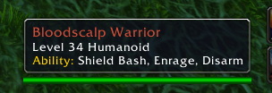

# TurtleBeastiary

Addon for [TurtleWoW](https://turtle-wow.org) that shows Abillitys of NPC

## Install

1. Download and extract [latest version](https://github.com/CamA-dev/TurtleBeastiary/archive/main.zip)
2. Copy the "TurtleBeastiary-main" folder to `<WoW>/Interface/AddOns` and rename it to "TurtleBeastiary"
3. (Re)start WoW
